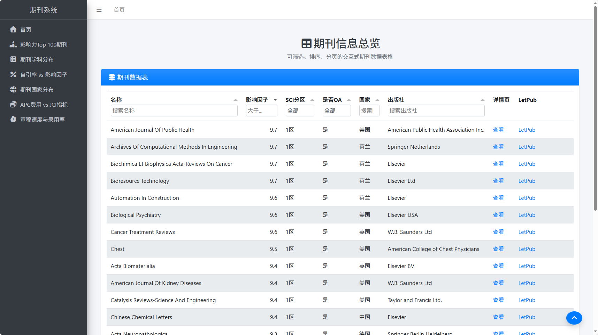
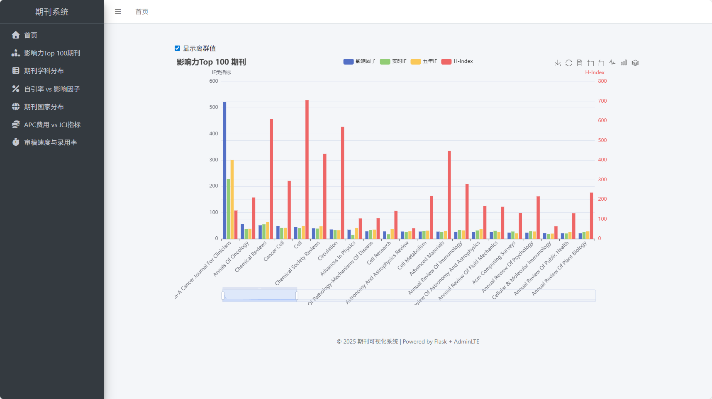
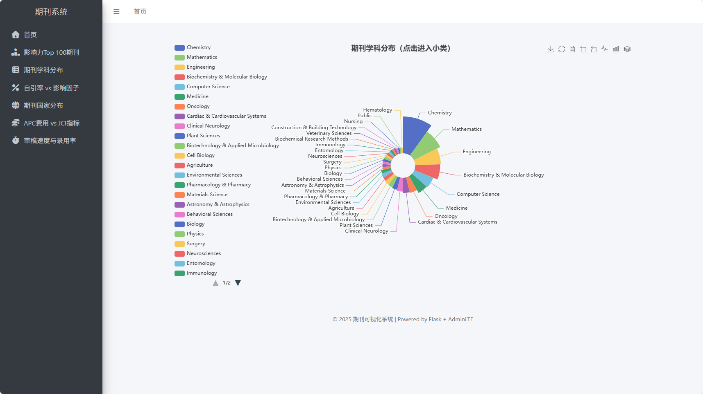
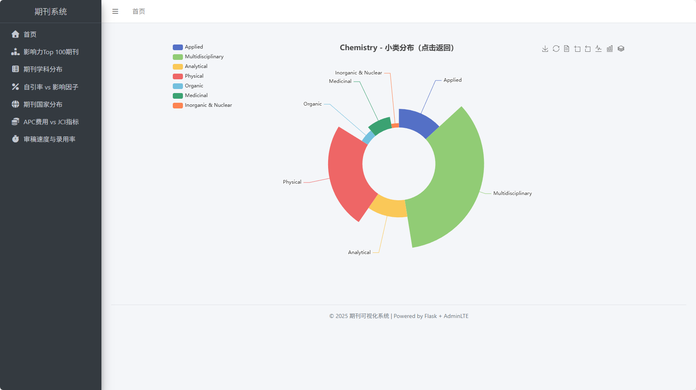
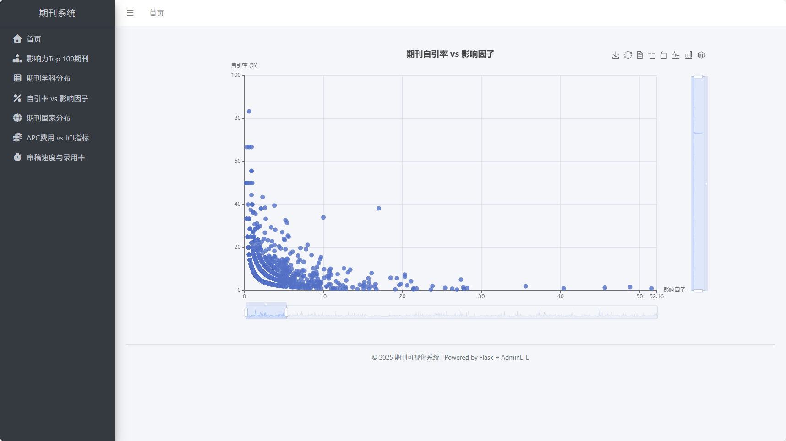
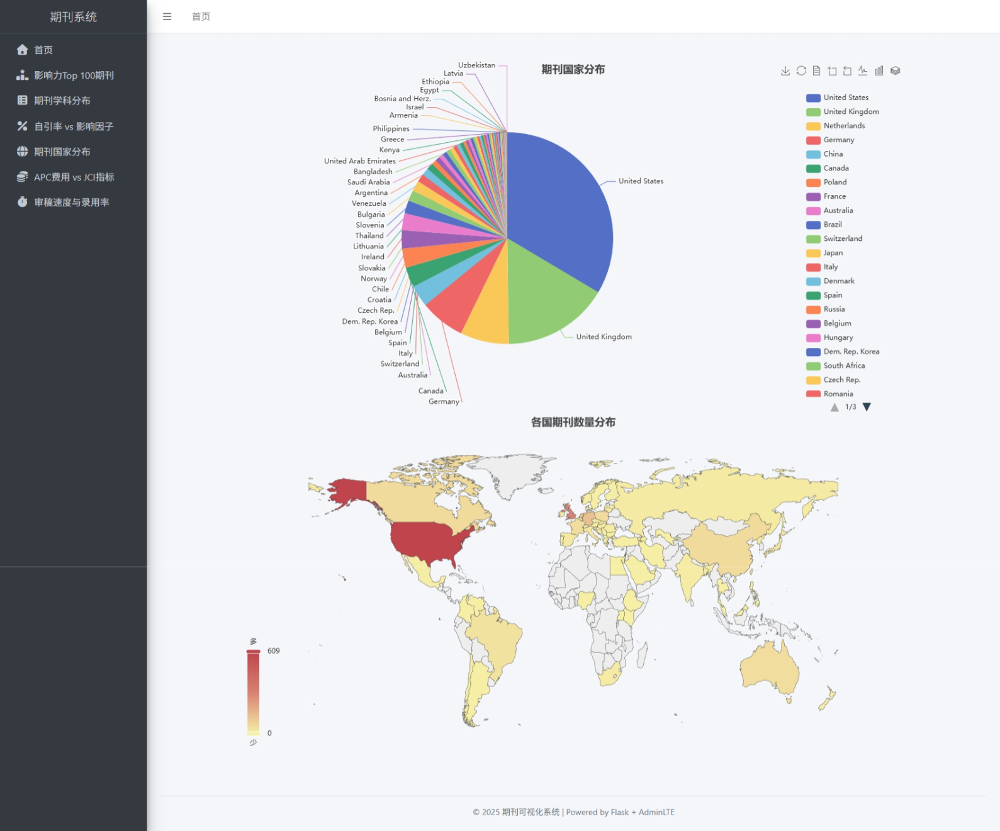
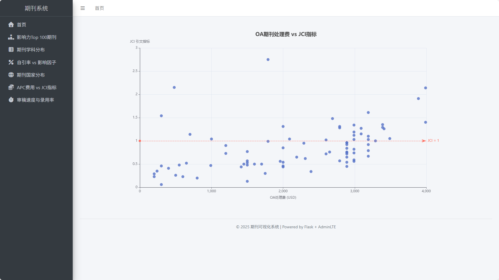

# LetPub 网站爬虫与可视化展示

本项目首先使用浏览器模拟操作爬虫爬取 LetPub 所有期刊信息，得到 `ndjson` 结果文件，随后 Flask 后端读取结果文件，并使用 Jinja2 渲染 HTML 模板，前端使用 ECharts 绘制可交互图表

**注**：目前 `journals.ndjson` 内仅存有一小部分期刊的信息，请自行爬取剩余期刊

## 项目文件说明

```
letpub_crawler
├── crawler             # 爬虫
│   ├── journal.py      # 期刊类
│   ├── lethub.py       # 爬虫主体
│   ├── utils.py        # 页面解析函数
│   └── journals.ndjson # 爬虫结果文件
├── static
│   ├── js              # 前端图表绘制
│   │   ├── chart.js
│   │   └── detail.js
│   └── echarts         # 世界地图 JS 库
│       ├── word.json
│       └── map
│           └── js
├── templates           # 页面模板
│   ├── chart
│   │   ├── apc_jci.html
│   │   ├── cite_if.html
│   │   ├── country.html
│   │   ├── factor.html
│   │   ├── review_accept.html
│   │   └── subject.html
│   ├── base.html
│   ├── detail.html
│   └── index.html
├── views               # 后端接口
│   ├── chart.py        # 图表接口
│   └── detail.py       # 期刊详情页接口
├── utils.py
├── app.py              # 主程序入口
└── env.yaml            # python 环境配置
```

## 页面展示

主页


影响力Top 100期刊


期刊学科分布（大类与小类）



自引率 vs 影响因子


期刊国家分布


APC费用 vs JCI指标


审稿速度与录用率

